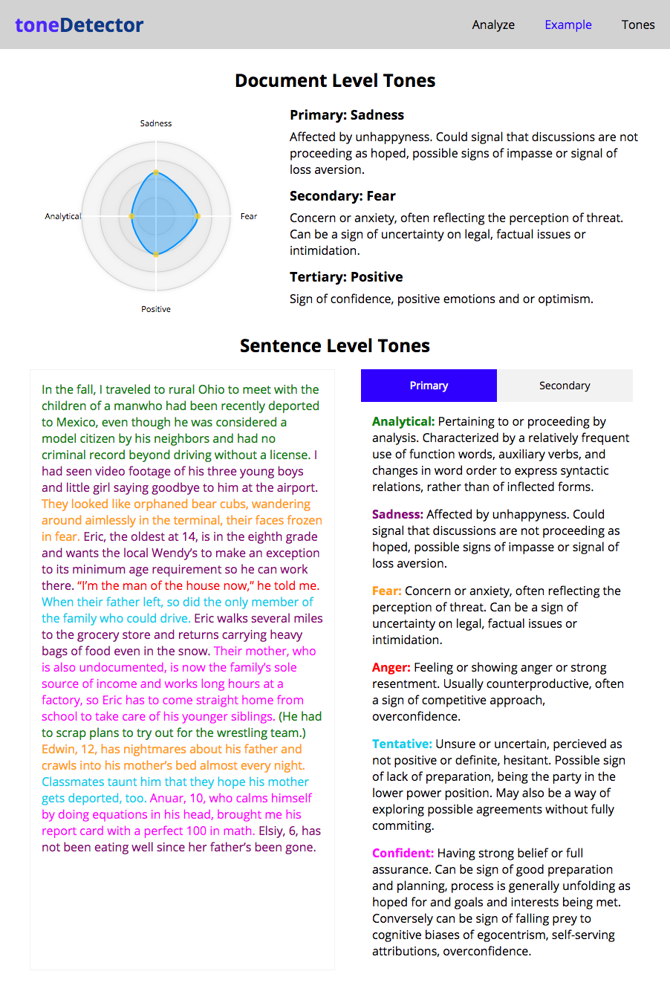
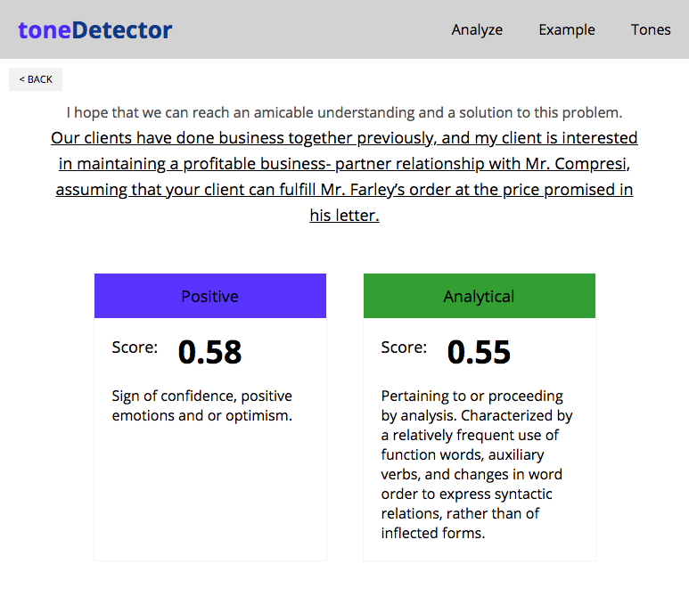

# ToneDetector

Provides tone analysis service for negotiators and mediators. Users enter text examples from negotiations and are given feedback as to the relevant tone analysis datapoints. Watson API, Node/Express backend (https://github.com/jjlljj/tone-detector-backend), and React/Redux/Router frontend with D3 visualizations.

To see a live version visit:
https://tonedetector.surge.sh

### Tone Analysis with D3 Charts

## Set Up

Fork this project

Run `npm install` from the root directory

Run `npm start` and visit localhost:3000 in your browser

## Testing

Begin running your tests with `npm test`
Initialize the enzyme adapter: [initializing the enzyme adapter](http://airbnb.io/enzyme/docs/installation/react-15.html) 
